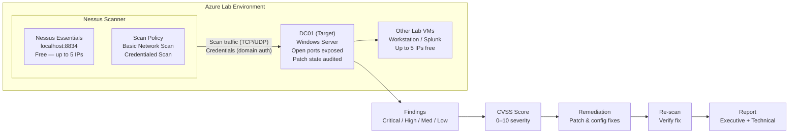

# Nessus-Lab-5
Nessus Vulnerability Scanning

Watch this - (https://www.loom.com/share/98724023fbdd4e71a3dd3cab9550ffcf)

**Tools:** Nessus Essentials (Free) · Azure Lab VMs
**Certification alignment:** CompTIA Security+ · CySA+ · PenTest+
**Time to complete:** 3–4 hours
**Cost:** $0 — Nessus Essentials is permanently free for up to 5 IPs

---

## Overview

Every network has vulnerabilities. The real question isn't whether they exist — it's whether the
security team finds them before an attacker does. This lab builds a full vulnerability management
workflow using **Nessus**, the most widely deployed vulnerability scanner in the industry: deploy
the scanner, run an unauthenticated discovery scan, run a credentialed (authenticated) scan,
interpret the results using the CVSS severity model, remediate a real finding, verify the fix with
a re-scan, and export a report suitable for both technical and executive audiences.

This is the same scan → find → remediate → verify loop that security teams run continuously in
production, just at a smaller scale and with less automation around it.

## The Business Problem This Lab Solves

Vulnerability management is the systematic process of finding, classifying, prioritizing, and
remediating security weaknesses before they can be exploited. Organizations run tools like Nessus
on a recurring schedule to answer three questions leadership always asks: *what's exposed, how bad
is it, and are we actually fixing it over time?*

Understanding this workflow — and being able to speak fluently about CVSS scores, credentialed vs.
unauthenticated scanning, and remediation tracking — puts a junior candidate ahead of most others
at that level, since most people have heard of Nessus but never actually run it.

| Role | How this lab applies |
|---|---|
| Vulnerability Analyst | Running regular scans, triaging findings, and tracking remediation — this *is* the core of the role |
| Security Engineer | Understanding vulnerability severity, CVSS scoring, and remediation priority to guide infrastructure decisions |
| SOC Analyst | Vulnerability data informs investigation priority — a machine with known CVEs is a higher-risk alert |
| Cloud Security Engineer | Cloud-native tools (Microsoft Defender for Cloud, AWS Inspector) build on the same concepts Nessus teaches |

## What This Lab Demonstrates

| Skill | Real-world application |
|---|---|
| Deploying and configuring Nessus | The scanner/policy/target architecture every enterprise vulnerability program is built on |
| Running a basic (unauthenticated) network scan | Discovering what services and ports are exposed — the external attacker's view |
| Running a credentialed scan | Authenticated scans typically surface 5–10x more findings than unauthenticated scans — the internal standard |
| Reading and interpreting CVSS scores | CVSS is the universal severity standard; every security conversation uses it |
| Prioritizing findings by severity | Not everything "critical" is equally urgent — prioritization also weighs exploitability and asset value |
| Running the remediation workflow | Find → assign → remediate → verify — the loop vulnerability programs run continuously |
| Exporting and presenting a report | Executives want business risk in plain language, not a list of CVE IDs |

## Architecture



## Severity Model Used in This Lab

| Severity | CVSS Range | What it means | Typical example |
|---|---|---|---|
| Critical | 9.0–10.0 | Remotely exploitable with little/no authentication — fix immediately | EternalBlue (MS17-010) — remote code execution |
| High | 7.0–8.9 | Significant impact if exploited — fix within 7–14 days | Unpatched RDP vulnerability |
| Medium | 4.0–6.9 | Requires certain conditions to exploit — fix within 30 days | Expired SSL certificate / weak cipher |
| Low | 0.1–3.9 | Minimal impact — track and fix in routine patch cycles | Missing security headers |
| Info | 0 | Not a vulnerability — informational only | Open port detected, OS version identified |

## Workflow Completed

1. Installed and configured Nessus Essentials, registered for a free activation code (5-IP license).
2. Ran an unauthenticated **Basic Network Scan** against the Lab 1 Windows Server (DC01) to establish the external attacker's view.
3. Ran a **credentialed scan** using domain administrator credentials, enabling Remote Registry and the required firewall rule first, to get the authenticated internal view.
4. Reviewed findings — synopsis, description, solution, CVE, CVSS score, risk factor, and plugin evidence — for both scans.
5. Selected one Medium/High finding, applied the documented remediation, and **re-scanned to verify the fix**.
6. Exported both an **Executive Summary** report (for stakeholders) and a **Detailed Vulnerabilities** report (for remediation tracking).

Full command-by-command instructions, including the *why* behind each step, are documented in
[`SOP_Lab5_Nessus.md`](./SOP_Lab5_Nessus.md).

## Results Summary

| Scan | Target | Findings |
|---|---|---|
| **Basic Network Scan** ("Lab Network Discovery") — unauthenticated | `172.16.0.4` | 3 non-informational findings + 91 Info-level findings (host authentication showed **Fail**, confirming this was the unauthenticated, outside-in view) |
| **Credentialed Scan** ("Lab Windows Server — Credentialed") | `172.16.0.4` | 31 distinct vulnerabilities across families including SSL, HTTP, SMB, TLS, SSH, and Windows/DCE service enumeration — a much deeper picture than the unauthenticated scan alone |

**Finding investigated:** `SSL Certificate Cannot Be Trusted` (Plugin #51192) — **Medium**, CVSS v3.0 base score **6.5**. The scan showed the certificate presented by the host was self-signed (`Subject: CN=WindowVm`, `Issuer: CN=WindowVm`) rather than issued by a trusted certificate authority, which is why it grouped together with the related `SSL Self-Signed Certificate` finding. Per Nessus's solution guidance, this is remediated by issuing/purchasing a proper CA-signed certificate for the service.

## Screenshots

### 1. Configuring the Basic Network Scan
Setting up the unauthenticated discovery scan — name, target IP, and scan template — before launch.

Basic Network Scan setup 


### 2. Scan Saved to My Scans
The "Lab Network Discovery" scan saved and ready to launch on demand.
Scan saved in My Scans  nacS


### 3. Scan History — Completed
Confirmation the scan ran to completion, with scan details (policy, severity base, elapsed time) in the side panel.
Scan history completed  


### 4. Basic Scan Host Results
Results for target `172.16.0.4` — 3 non-informational findings and 91 Info-level findings, with **Auth: Fail** confirming this was the unauthenticated (outside-in) scan.
![Basic scan host results] 


Hovering the vulnerability bar shows the split by severity — the overwhelming majority (96.81%) were Info-level, expected for an unauthenticated scan against a reasonably maintained host.
Basic scan severity breakdown 


### 6. Credentialed Scan Results
The "Lab Windows Server — Credentialed" scan surfaced 31 distinct vulnerabilities — a far broader picture than the unauthenticated scan, since Nessus could now inspect the host from the inside (SSL, SMB, TLS, SSH, and Windows service enumeration all appear here).
Credentialed scan vulnerabilities 


### 7. Finding Detail — SSL Certificate Cannot Be Trusted
Drilling into the Medium-severity finding (CVSS 6.5): the plugin output confirms the certificate is self-signed rather than issued by a trusted CA, along with the recommended solution.
SSL certificate finding detail 


### 8. Related SSL Findings Group
The full group of SSL-related findings on the host, showing how Nessus clusters related issues (self-signed certificate, certificate info, supported cipher suites) together for triage.
SSL finding group 


## Repository Contents

```
lab5-nessus/
├── README.md                     # This file — portfolio-facing overview
├── SOP_Lab5_Nessus.md            # Detailed, beginner-friendly step-by-step walkthrough
├── scripts/                      # PowerShell remediation & config commands used in the lab
└── screenshots/                  # Evidence captured during the walkthrough
```

## Verification Checklist

| Check | How it was verified |
|---|---|
| Basic scan completed | Scan produced findings — even a fully patched server returns Info-level findings |
| Credentialed scan completed | Finding count significantly higher than the unauthenticated scan |
| Remediation verified | The remediated finding no longer appeared after the re-scan |
| Report exported | PDF report generated and reviewed, showing findings with CVSS scores |

---

**Portfolio note:** This lab demonstrates the full vulnerability management lifecycle — scan,
triage by severity, remediate, and verify — using the industry-standard tool for the job. It
maps directly to the Vulnerability Analyst and Security Engineer job functions and reinforces
CVSS fluency, a skill referenced in nearly every security interview.
